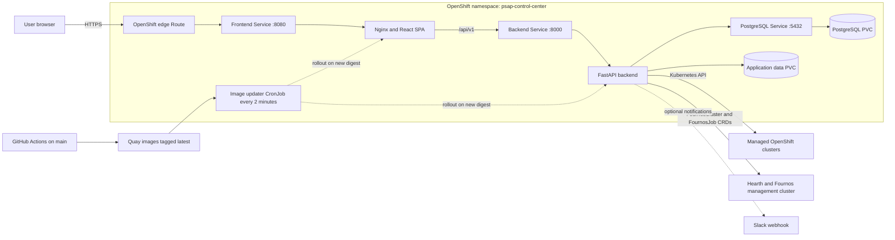

# PSAP Control Center

A cluster management and reservation platform for the Performance and Scale for AI Platforms (PSAP) team. Provides observability into OpenShift cluster health, a reservation system with calendar views, and Hearth GPU discovery integration.

Deployment URLs are environment-specific. Discover the route for an OpenShift
deployment with:

```bash
oc get route psap-control-center -n <namespace> \
  -o jsonpath='https://{.spec.host}{"\n"}'
```

## Features

- **Cluster Registry** — Add and monitor clusters with live health, node topology visualization, OCP details, operators, and workloads.
- **Reservation System** — Full-cluster or partial GPU reservations with type-aware conflict detection. Color-coded calendar, cancellation tracking, and historical preservation when clusters are removed.
- **GPU Allocation & DRA** — Live GPU status via DRA (`resource.k8s.io`) with automatic fallback to legacy node capacity counting. Per-GPU-type breakdowns, ConfigMap-driven vendor abstraction.
- **Namespace Enforcement** — GPU reservations automatically provision isolated Kubernetes namespaces with `ResourceQuota` and optional DRA `ResourceClaimTemplate`. Namespaces are cleaned up on completion, cancellation, or deletion.
- **Calendar Views** — Weekly preview with overlapping reservation display (index-based opacity for distinguishing coexisting reservations), plus full month/week/day calendar.
- **Hearth Integration** — Discover GPU inventory from `FournosCluster` resources on a shared Hearth/Fournos management cluster.
- **Fournos Testing (development)** — Monitor live and archived test runs, submit schema-driven Forge jobs, schedule recurring work, and coordinate cluster locks from the Testing tab.
- **Cost Explorer & Billing** — Compare public, estimated, and actual infrastructure costs using cluster snapshots and uploaded IBM Cloud billing reports.
- **Slack Notifications** — Configure an incoming webhook for reservation notifications from the admin settings page.
- **Role-Based Access** — Public read access, signed-in reservation workflows, and administrator-only cluster, integration, billing, and cost management.
- **Structured Logging** — Consistent log format across backend and frontend, configurable via `LOG_LEVEL`.

## Tech Stack

| Layer | Technology |
| ----- | ---------- |
| Frontend | React 18, TypeScript, Vite, Tailwind CSS, TanStack Query; served by Nginx |
| Backend | Python 3.11, FastAPI, async SQLAlchemy, Kubernetes client |
| Database | SQLite for local development; PostgreSQL in production |
| Platform | OpenShift Routes, Services, Deployments, and persistent volumes |
| Delivery | GitHub Actions → Quay.io → in-cluster image-updater CronJob |
| Local runtime | Docker Compose or separate Vite/FastAPI processes |

## Production Architecture



The public Route terminates TLS at OpenShift and sends all traffic to Nginx.
Nginx serves the React application and proxies `/api` requests to FastAPI.
The backend stores application records in PostgreSQL and communicates with
managed clusters and the Hearth/Fournos management cluster through their
Kubernetes APIs.

Production delivery is pull-based: a push to `main` builds the frontend and
backend images in GitHub Actions and publishes `:latest` tags to Quay. An
in-cluster CronJob checks the image digests every two minutes and restarts only
the deployments whose digest changed. GitHub Actions does not require direct
access to the OpenShift API.

## Testing Tab (Development)

The development branch includes a Fournos-backed Testing workspace. It uses the
same management-cluster connection as Hearth, while the browser communicates
with Control Center's API.

- **Live Jobs** polls active `FournosJob` resources and opens a detail view with
  pipeline progress, pods, events, and streaming logs.
- **History** reads completed jobs archived in the Control Center database and
  supports project, cluster, status, date, sorting, and pagination controls.
- **Submit Job** discovers Forge projects and pipelines, renders project-owned
  `ui/submit.yaml` schemas, supports standard or matrix submissions, and can run
  immediately, defer a run, or create a recurring schedule. Custom non-Forge
  job definitions remain a planned capability.
- **Schedules/Locks** manages recurring jobs and immediate or scheduled cluster
  locks, with cluster activity and child-run views.

Read-only Testing views are public. Submitting work, creating locks, and holding
calendar slots require a signed-in user. Cancelling or rerunning jobs, deleting
history, triggering or deleting schedules, and releasing locks require an
administrator.

## Quick Start

### Docker Compose

```bash
git clone https://github.com/openshift-psap/psap-control-center.git
cd psap-control-center
cp .env.example .env    # Review configuration as needed
docker compose up --build -d
```

- UI: http://localhost:3000
- API docs: http://localhost:8000/docs

### Local Development

```bash
# Backend
cd backend
python -m venv venv && source venv/bin/activate
python -m pip install -r requirements.txt
uvicorn app.main:app --reload

# Frontend (separate terminal)
cd frontend
npm install
npm run dev
```

- Frontend: http://localhost:3000 (Vite proxies /api to :8000)
- Backend: http://localhost:8000

### OpenShift Deployment

See [deploy/README.md](deploy/README.md) for the full OCP deployment guide.

## Access Control

| Role | Access |
| ---- | ------ |
| Public | View clusters, reservations, calendars, Hearth inventory, and health status |
| User | Public access plus authenticated reservation workflows |
| Admin | Full access, including clusters, approvals, Hearth, Slack, billing, and cost management |

Sign in from the top-right corner of the UI. Sessions last eight hours by
default.

## Configuration

| Variable | Default | Description |
| -------- | ------- | ----------- |
| `DATABASE_URL` | `sqlite+aiosqlite:///./psap_control_center.db` | Async SQLAlchemy connection string |
| `HEARTH_ENABLED` | `true` | Enable Hearth/Fournos integration |
| `HEARTH_NAMESPACE` | `hearth` | Namespace containing `FournosCluster` resources |
| `FOURNOS_NAMESPACE` | `psap-automation` | Namespace containing `FournosJob` resources |
| `FOURNOS_K8S_TIMEOUT` | `30` | Kubernetes API timeout for Fournos operations, in seconds |
| `FORGE_GITHUB_REPO` | `openshift-psap/forge` | Forge repository used for project, schema, pipeline, and pull-request discovery |
| `FORGE_GITHUB_REF` | `main` | Forge ref used for repository content discovery |
| `GITHUB_SYNC_INTERVAL_SECONDS` | `3600` | Background Forge metadata refresh interval |
| `FOURNOS_DEFAULT_PIPELINES` | Built-in list | Fallback comma-separated pipeline names |
| `BILLING_CSV_STORAGE_PATH` | `./billing_csvs` | Billing report storage directory |
| `LOG_LEVEL` | `INFO` | Backend log level: ERROR, WARN, INFO, or DEBUG |
| `MLFLOW_BASE_URL` | Optional | Reserved for the planned Results integration |
| `VITE_LOG_LEVEL` | `INFO` | Frontend build-time log level |
| `VITE_ENV_BANNER` | Optional | Frontend build-time environment banner |

## Documentation

| Document | Description |
| -------- | ----------- |
| [Architecture](docs/ARCHITECTURE.md) | System design, data model, API surface, deployment topology |
| [User Guide](docs/USER_GUIDE.md) | How to use the application |
| [Contributing](docs/CONTRIBUTING.md) | Branch workflow, code standards, PR process |
| [Troubleshooting](docs/TROUBLESHOOTING.md) | Common issues and solutions |
| [OCP Deployment](deploy/README.md) | Step-by-step OpenShift deployment guide |
| [Release Process](docs/RELEASING.md) | Automated semantic versions and release images |

## API

Interactive documentation is available at `/docs` (Swagger) and `/redoc` when the backend is running.

Key endpoints:

| Endpoint | Method | Access | Description |
| -------- | ------ | ------ | ----------- |
| `/api/v1/health` | GET | Public | Service health |
| `/api/v1/clusters` | GET | Public | List clusters |
| `/api/v1/clusters` | POST | Admin | Add a cluster |
| `/api/v1/clusters/{id}/topology` | GET | Public | Node topology |
| `/api/v1/clusters/{id}/gpu-status` | GET | Public | Live GPU allocation using DRA or legacy capacity |
| `/api/v1/reservations` | GET | Public | List reservations |
| `/api/v1/reservations` | POST | Signed in | Create a full-cluster or GPU reservation |
| `/api/v1/reservations/{id}/cancel` | POST | Signed in | Cancel an authorized reservation |
| `/api/v1/reservations/calendar` | GET | Public | Calendar events |
| `/api/v1/hearth/status` | GET | Public | Management-cluster connection status |
| `/api/v1/hearth/clusters` | GET | Public | Hearth GPU inventory |
| `/api/v1/fournos/runs` | GET | Public | Paginated live or archived Fournos runs |
| `/api/v1/fournos/jobs/{name}` | GET | Public | Job detail, stages, pods, events, and logs |
| `/api/v1/fournos/submit` | POST | Signed in | Submit a Fournos job |
| `/api/v1/fournos/submit-matrix` | POST | Signed in | Submit a matrix of Fournos jobs |
| `/api/v1/fournos/recurring-jobs` | GET | Public | List recurring jobs; creation uses the submit endpoint |
| `/api/v1/fournos/cluster-locks` | GET/POST | Public / signed in | List or create cluster locks |
| `/api/v1/cost-explorer/snapshots` | GET | Admin | Cost snapshots |
| `/api/v1/billing/upload` | POST | Admin | Upload a billing CSV |

See [docs/ARCHITECTURE.md](docs/ARCHITECTURE.md) for the complete API reference.

## License

[Apache License 2.0](LICENSE)

## Related Projects

- [TOPSAIL](https://github.com/openshift-psap/topsail) — Test Orchestrator for Performance and Scalability of AI pLatforms
- [Performance Dashboard](https://github.com/openshift-psap/performance-dashboard) — RHAIIS benchmark analysis
